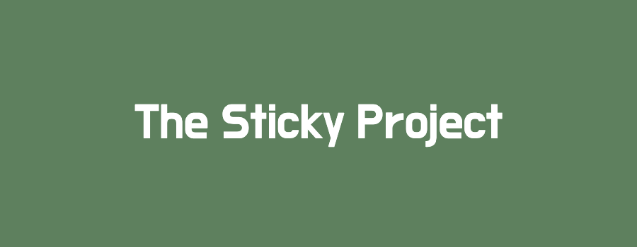

<div align="center" width="100%">
  
</div>


<div style="text-align: center;" markdown="1" align='center'>

 **An overview of how _position property_ works and some examples.** 


 </div>

---

  <p align='justify' markdown="1" style="text-align: justufy;"> 
  
  The Position property is an essential feature you should have when creating a website, therefore it's crucial to understand how position property works and how to implement it, this small but awesome project will guide you through all the different values and how to implement them within your project.</p>

# Features
  * React.
  * Bootstrap.

This project was created using the command `npx create-react-app`, node version `16.13.1`

# Installation

```
$ git clone https://github.com/leonsuaren/sticky-property.git
$ cd sticky-property
$ npm install
$ npm start
```

